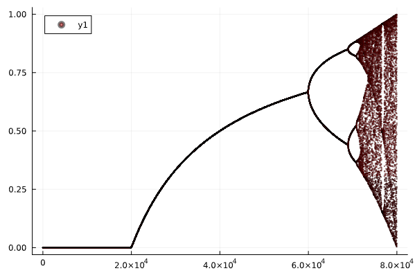
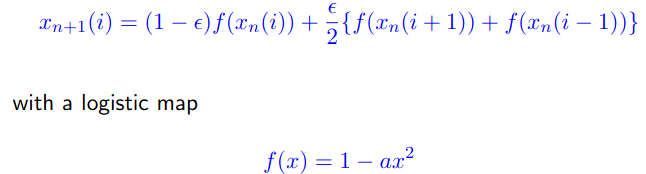
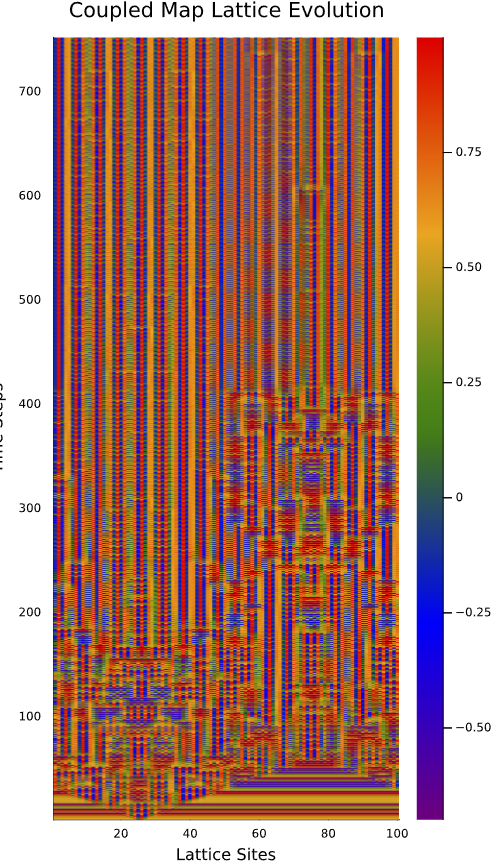

Sudeep Maurya MS21130  
  

The code was written using julia language in the jupyter notebook.  
The Logistic_map.ipnb contains the logistic map and the bifurcation diagram.  

  

The CML.ipynb contains the main code for coupled map lattics.  
The equations are   

Suppression of chaos occurs when a = 1.7 (close to chaotic regime but not fully chaotic, to encourage suppression of chaos) and eps = 0.6 (stronger coupling to suppress chaos).  
the chaos ends after time step = 400.  

